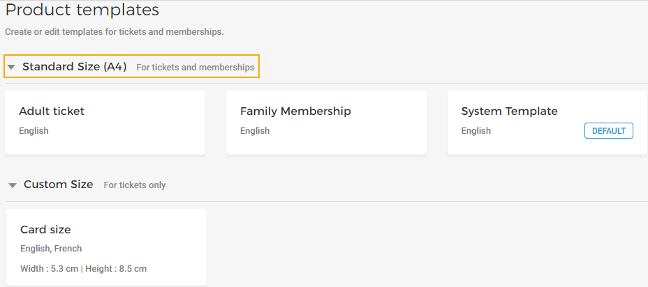
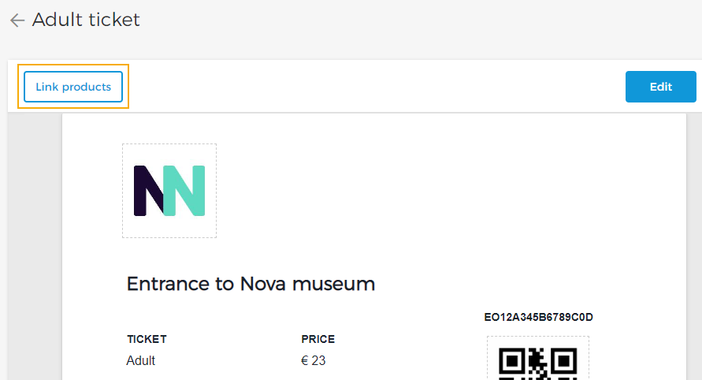
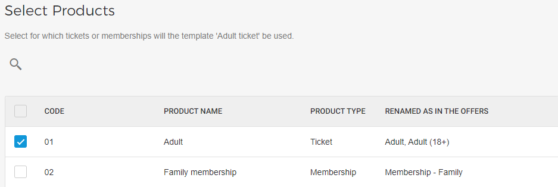
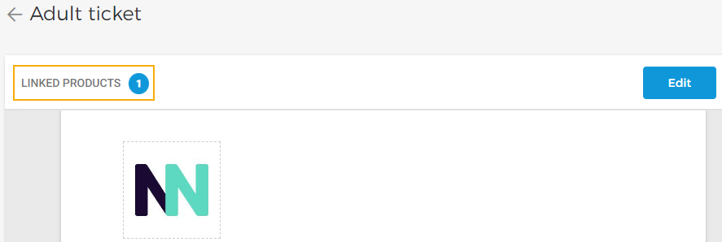

#### Link tickets/memberships


![[Note]](media/note.png)
The option to link a template with tickets/memberships is available for Standard size (A4) ticket templates and [Responsive templates](UUID-5156baa7-4d9b-d8e9-fcd0-7e3052a3906a.html#UUID-5156baa7-4d9b-d8e9-fcd0-7e3052a3906a_section-idm4517193403729633750335349604) . The Custom size templates are required to be [linked with sales points](UUID-85e7dbf1-19e4-fed4-9fa3-28a4f6f7dc13.html) .


![[Note]](media/note.png)

Once you have published a Standard size (A4) template, you will be able to link it with the tickets or memberships for which the template will be used.

On the page, click on a Standard size (A4) template you want to link with tickets/memberships.

On the resulting page, click in the top-left corner of the preview panel.

Next, select the tickets/memberships for which you wish to use the template.

Note that you will see products in the following format:

Code

For a Ticket product, this is the ticket code as defined in Recreatex or in Enviso (in case of [tickets created in Enviso](https://help.gantner.com/enviso/en/134879-135202-managing-tickets.html) ).

For a Membership product, this is the code automatically generated when creating a Membership product in Enviso Sales.

Product name

For a Ticket product, this is the ticket description as defined in Recreatex or in Enviso (in case of [tickets created in Enviso](https://help.gantner.com/enviso/en/134879-135202-managing-tickets.html) ).

For a Membership product, this is the name of the Membership defined at the time of creating it in Enviso Sales.

Product type

Indicates whether the product is a Ticket or Membership.


![[Note]](media/note.png)
Membership products will be shown only if the feature to sell Membership offers has been enabled for your venue.


![[Note]](media/note.png)

Renamed as in the offers

This column contains all the names that you have used for the tickets fetched from Recreatex at the time of creating offers in Enviso Sales.

In Enviso Sales it is possible to rename the tickets fetched from Recreatex. Refer [Edit ticket name and price](https://help.gantner.com/enviso/en/134879-135207-create-an-offer.html#134879-135212-edit-ticket-name-and-price) .

In case of a Membership product, these are the names used for the membership at the time of creating offers in Enviso Sales

Click in the bottom-right corner of the window to link the selected products with the template.

Next, on the template preview page, you will be able to see the number of linked products.

##### Important to know

It is possible to link one Standard size ticket template with multiple tickets. However, one ticket can be linked to only one Standard size ticket template.

For tickets that are not linked with any template, the [default template](UUID-863c9d70-1b9a-dd88-b398-bed9f2daab8c.html) for Standard size tickets will be used.

It is possible to link either Ticket-type or Membership-type products to a template.

Next, you can [add translations](UUID-5320ad87-921d-ee72-df1e-273e1e1dfba5.html) for the product template.