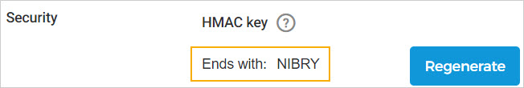

## Webhooks

From the Webhooks page, you can create webhooks to facilitate automated notifications when certain events occur, such as order confirmation, cancellation, rebooking, and so on.

On the Webhooks page, you can consult the [created webhook](UUID-bd06b7a9-6eb4-f939-128c-a1e938032e52.html) , [test the webhook](UUID-842af4ea-b150-c5e3-be37-89290a061fc2.html) , and [view webhook notification logs](UUID-7f2c893f-20e3-fbe1-d131-896cd9493758.html) .

### Consult webhooks

On the Webhooks page, you can consult the created webhooks along with their status.

Clicking on a webhook, you can consult its details in a side panel.

In case any event notification of a webhook fails, the system will auto-retry to send that event notification. When the system auto-retry duration expires and still the notification is not delivered, then you will see an alert icon next to the status of that webhook.

You can check the remark for the failed notification from the [webhook notification logs](UUID-7f2c893f-20e3-fbe1-d131-896cd9493758.html) page.

### Edit a webhook

#### Edit a webhook

On the Webhooks page, click on the more options button (...) corresponding to a webhook to edit it.

When , only the last five characters of the HMAC key are shown.

If you haven't saved the HMAC key generated at the time of creating the webhook, you can regenerate it.

When an active webhook is edited and saved, the system prompts the user to test the updated webhook to ensure that the updated configurations are correct.

### Delete a webhook

On the Webhooks page, click on the more options button (...) corresponding to a webhook to delete it.

