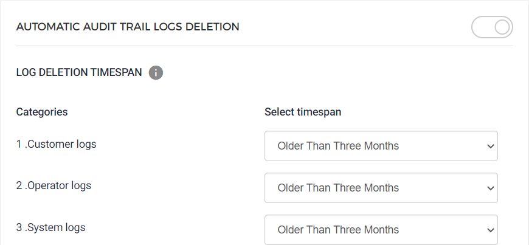

### Audit trail

The tab contains settings that allow you to define the timespan beyond which the data logs will automatically be deleted.

You can define the log deletion time span for Customer logs, Operator logs, and System logs.

By default, the log deletion time span is defined as older than three months for all data log types.