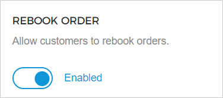
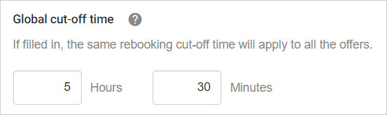
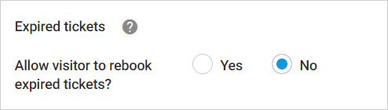
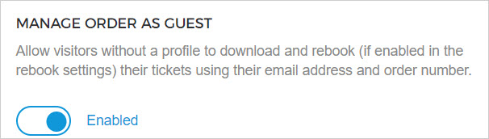
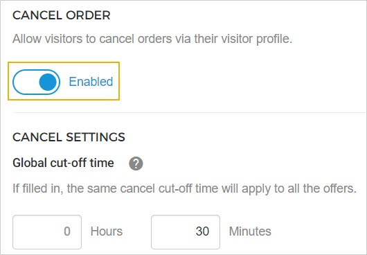
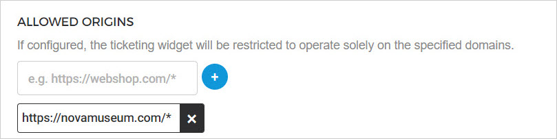

### Widget settings

From the tab , you can configure the Visitor profile parameters for your Enviso Ticketing widget. The user should have permission to manage visitors for accessing the Visitor settings page.


![[Note]](media/note.png)
Visitor settings are applicable only for the .


![[Note]](media/note.png)

#### Rebook order

Allows a visitor to rebook an order from their visitor profile registered on the Enviso Ticketing widget.

If Rebook order is , you will have the option to configure various settings related to rebooking. Moreover, if enabled, you will have the option to allow rebooking on the offer level in the Envsio Sales app.

##### Global cut-off time

If filled in, the same rebooking cut-off time will apply to all the offers. If left blank, the cut-off time defined at the [offer level](https://help.vintia.com/enviso/en/134879-474480-offer-details.html#134879-UUID-99420e09-18f0-1fad-c746-026e3fc4a7b2_section-idm4620166917761634120081247156-other-details) in the Sales app will apply.


![[Note]](media/note.png)
This cut-off time will overwrite the rebooking cut-off timing defined at the offer level for the offers.
It is useful, for example, when you wish to have a standard cut-off timing for rebooking orders of any offer.


![[Note]](media/note.png)

##### Expired tickets

If allowed, the visitor will be able to rebook from their visitor profile on the Ticketing widget.

#### Manage order as guest

If enabled, it allows visitors without a profile to download tickets and rebook orders without having to create or log into their profile on the Ticketing widget. A guest user can do so by using the and their .


![[Note]](media/note.png)
To be able to rebook order as a guest, the setting [Rebook order](https://help.vintia.com/enviso/en/140073-438940-visitor-self-service.html#140073-UUID-12f0ea55-8c91-e90e-aae3-72eba94833fc_section-idm4641037739884833931714109716-rebook-order) must be enabled.


![[Note]](media/note.png)

#### Cancel order

Allows a visitor to cancel an order from their visitor profile registered on the Enviso Ticketing widget.

If Cancel order is enabled, you will have the option to define the cut-off time until when tickets can be cancelled before the visit time.

#### Allowed origins

Specifying the allowed origins ensures the Ticketing widget can only be rendered on the specified domains. Instead of validating the full URL, only the origin is validated. If no domains are set, the Ticketing widget can be displayed on any page.

This action is logged in the [audit records](UUID-64a1a84a-f4c0-e20a-6da2-ff59bba0ff25.html) .