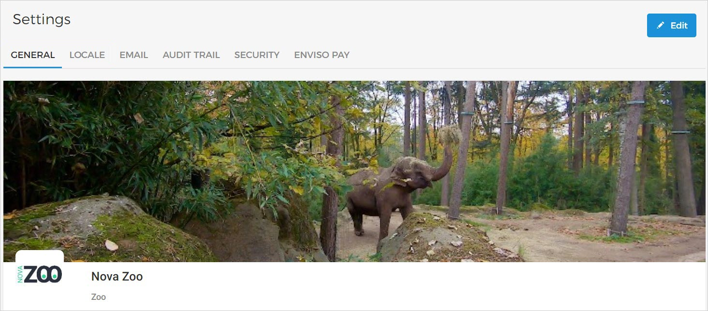

### General

The General settings allow you to edit the Venue/Reseller's organisation name, logo and other details. Click in the top right corner of the organisation's profile page to edit the details.

Cover image

Click the camera icon in the bottom-right corner of the cover image section to edit the cover image.

The Venue cover image must be at least 800x600 pixels in resolution. The image size must be less than 2MB.

After the cover image is successfully uploaded, it will automatically be saved.

Logo

Click on the camera icon in the logo section to edit the Venue logo.

The Venue logo should be an 1:1 ratio image, with minimum resolution of 150x150 pixels. The image size must be less than 2MB.

After the logo image is successfully uploaded, it is saved automatically.

Venue name and type

It is possible to edit the Venue name and type, which was entered at the time of registration.

Click the edit icon and make the required changes.

Info

Click the edit icon in the Info section. Next, you will be able to enter or edit the information about your Venue. The Venue info must not exceed 5000 characters.

Address

This field is pre-filled with the address entered at the time of registering [as a new user](/document/preview/136643#UUID-c9498c00-8c33-b0ef-a36e-d48547c3ae41) .

Click the edit icon in the section to modify the address. Click to apply the changes.

Dependent on the address, the Google map on the right will automatically pin the location.

Phone

Click the edit icon in the Phone section to enter or edit the contact number.

Avoid using space because the Phone field is restricted to 15 characters.

Website

Click the edit icon in the Website section to enter or edit your Venue's website URL.

It is obligatory to add http:// or https:// before your website URL.

https://www.novamuseum.com

Social links

Click the edit icon in the Social links section to add or edit your Venue's social media links.

It is obligatory to add http:// or https:// before each social media link.

https://www.facebook.com/novamuseum

Be sure to enter the social media links in their corresponding fields. Only the filled-in social media links will show on your Venue's profile.