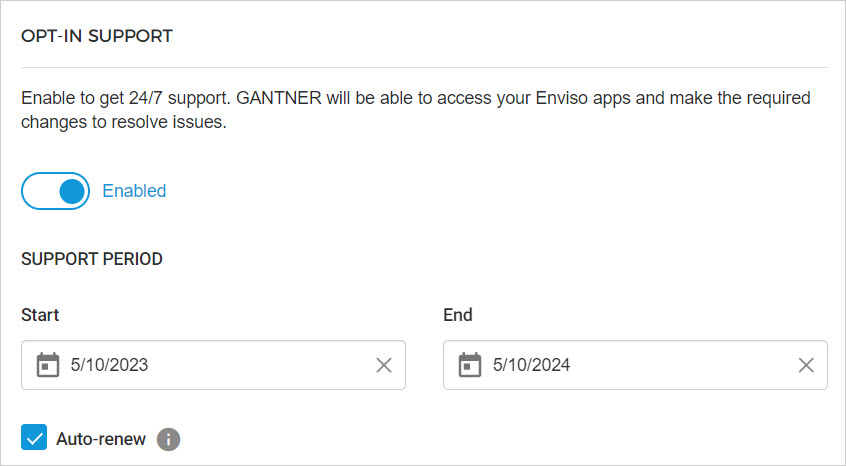
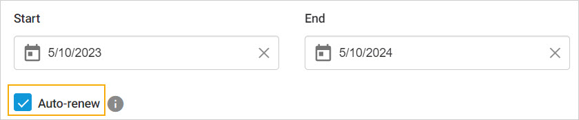

## Support and help

The Support & Help page contains resourceful documentation and ways to connect with Vintia support.

### Request support

If you wish to raise a concern or request a new feature, reach out to Vintia support by raising a ticket.

### Opt-in support

Enable opt-in support to get remote support. This way you allow Vintia support engineers to access your environment and make the required changes to resolve issues.

Based on your specific needs, you can define the support period for a minimum of 2 hours to a maximum of 1 year.

By default, the end date is set to one year from the start date, and the option to auto-renew is checked. This means, by default, the support period will auto-renew each year. You can de-select auto-renew if you do not wish the support period to be renewed automatically.


![[Note]](media/note.png)
While providing remote support, the 'My profile' page will be hidden from the support engineer.


![[Note]](media/note.png)

By default, auto-renew is checked and the support period will be renewed for one year from the end date. You can de-select auto-renew if you do not wish the support period to be renewed automatically.


![[Note]](media/note.png)
The Admin user will receive reminder emails to renew their support period twice. The first reminder email will be sent seven days before the expiration date and the second email will be sent on the day of the support period expiration.


![[Note]](media/note.png)

### Documentation

In this section, you will find links to the user documentation for Enviso apps and APIs.

### Customer service center

If you wish to give a quick call to the customer service center, use the contact numbers in this section.

### Legal

This section contains legal documents pertaining to the use of Enviso apps.