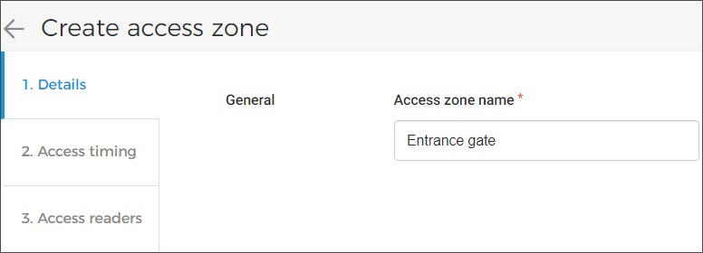

## Access control


![[Note]](media/note.png)
The feature to manage Access control is available to . You can request [Vintia support](https://vintia.atlassian.net/servicedesk/customer/portal/8) to enable this feature for your venue.


![[Note]](media/note.png)

The page Access zones allow you to manage access zones and access readers. For an access zone, you can configure access timing, create multiple readers and link readers with the zone.

To manage access control, the user should have the [user permission](UUID-80203675-f81e-998f-d13e-b61d4d3d5dc2.html) 'Manage infrastructure' (Admin app).

Once configured, an access zone can be linked with a [membership offer](https://help.vintia.com/enviso/en/134879-372514-membership-offer.html) from the Sales app (My offers > [Offer details](https://help.vintia.com/enviso/en/134879-135225-consult-offers.html) > tab Access control). As a result, at the time of access, a valid membership will additionally be validated with the configurations of the linked access zone.

### Create access zone

Click on the button in the top-right corner of the Access zones page. Next, you will be navigated to the Create access zone page.

### Details

Enter the name of the access zone in the field Access zone name. The character limit for access zone name is 100 characters.

### Access timing

Period

Enter the start date and end date for access at the zone.

Days of the week

Select the days of the week when access will be granted at the zone

Accessible time

Enter the start time and end time of accessing the zone and save the details.

In case of multiple time slots in a day, repeat the process of adding the same Period and Days of the week with a different time slot for all the time slots you wish to create for a day.

Access timing calendar

After saving the configuration, when you select to edit a zone from the Access zone page and then go to the tab (tab Access timing), (1) you will see that the dates that have time slots configured for them are marked with a blue dot.

(2) Click on a date to view the time slots for that day.

(3) Using the delete icon, you can remove a time slot for a particular date.

### Access readers

1. Enter the access reader's name and click on the '+' icon to create and link the reader with the zone. Repeat this for adding and linking multiple readers with the zone. Note that the readers are populated below.

2. Click on the delete icon corresponding to the linked reader to remove it.

### Edit/Delete access zone

Once created, it is possible to edit or delete an access zone on the Access zones page. Hover over the access zone that you wish to edit or delete. From the more options menu, select the desired option.

