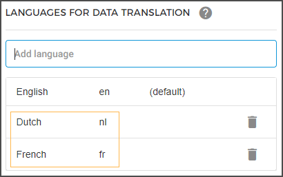

### Locale

#### Regional settings

 Select the region where your organisation is located. Dependent on the parameter Locale, the fields Currency, Date format, and Time format (where applicable) will change accordingly.

 Define the time zone to which the organisation belongs.

#### Languages for data translation

In this section, you can add the languages in which you wish to provide translations for offers, products, visitor and guide emails, and visitor info form.


![[Note]](media/note.png)
In case of indirect sales, the reseller may or may not choose to use your translations.


![[Note]](media/note.png)

Enter the language that you wish to add. By default, English will already be added.

The added languages will populate in the list of languages.

 Once you add a language, it will be available for adding translation strings. For a detailed description, refer adding translations for email, ticket, offers and visitor info form.

Click the delete icon corresponding to a language, to remove it from the list of translation languages.

Next, a confirmation popup will appear, wherein you will need to enter the language name exactly the way you had entered at the time of adding it. This is to ensure that a language is not deleted accidentally.

![[Warning]](media/warning.png)

When removing a language, all the content and templates of the deleted language will be removed.