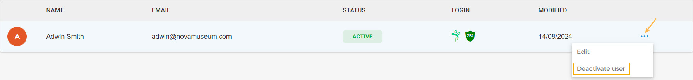

### Deactivate a user

To deactivate a user, click on the more options button corresponding to the user. From the resulting drop-down, select .

Once deactivated, the user will be flagged as Inactive. To activate the user, click on the more options button corresponding to the user. From the resulting drop-down, select .


![[Note]](media/note.png)
As long as there is at least one super admin, it is possible to deactivate a user with the role of Super Admin.


![[Note]](media/note.png)