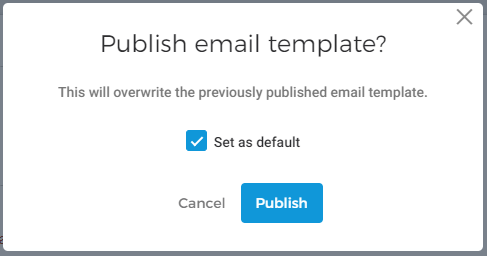

#### Publish email template

Publishing an email template will allow you to [link it with offers](https://help.gantner.com/enviso/en/134879-135207-create-an-offer.html#134879-135217-email-templates) . You can also choose to [set a template as default](UUID-863c9d70-1b9a-dd88-b398-bed9f2daab8c.html) .


![[Note]](media/note.png)
Setting a template as default means, the template will be used when an email template is not linked with an offer.


![[Note]](media/note.png)

It is possible to set only one template as default. Therefore, if the template is the only template or it is already marked as a default template, the option to set it as default will be disabled.