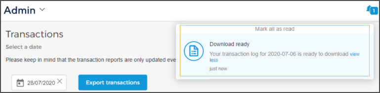

## Transactions

The page Transactions, allows you to generate a report of all the payment and refund transactions made using Enviso Pay. The user should have [permission](UUID-80203675-f81e-998f-d13e-b61d4d3d5dc2.html) to 'View transactions' (Admin app).


![[Note]](media/note.png)
A license is required to use Enviso Pay for processing payments. See further, [Licenses](UUID-57d91eb4-f6c0-d518-2046-727a12aed400.html)


![[Note]](media/note.png)

Select a date and click .

Generating the report might take some time. It is recommended that you refresh your page. Once generated, you will receive a notification that your transaction log is ready to download. Click on the notification to download it.

