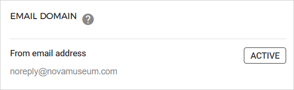
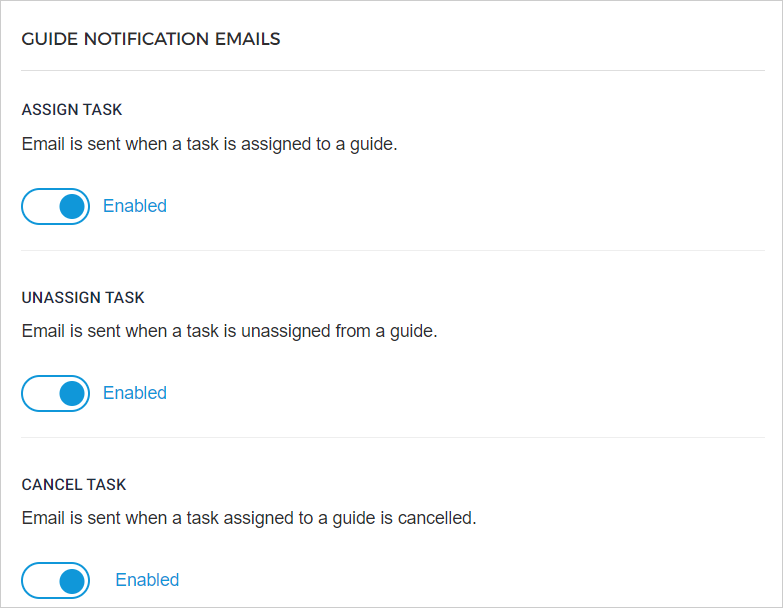

### Email

#### Email domain

You can consult the email address from which emails will be sent to the visitors for orders placed on the direct as well as indirect channel sales points.

If you wish to change the From email address or if the status doesn't show Active, contact [Vintia support](https://vintia.atlassian.net/servicedesk/customer/portal/8) .

#### Guide notification emails

It is possible to configure which email notifications will be sent to your connected guide. This email configuration is useful if you are using the Enviso Booking app to manage guide tasks.


![[Note]](media/note.png)
If the guide has provided his/her [interim office's email address](https://help.gantner.com/enviso/en/134571-134737-manage-user-profile.html#134571-UUID-d03be5dd-8f2c-c3ff-22c3-6633a1dfaf36_section-idm232129605367398-finances) , the emails will be copied to the interim office as well.


![[Note]](media/note.png)

You can configure the [email template](UUID-c84f022f-f346-0e50-a99b-1f4e5990b90b.html) and [add translations](UUID-5320ad87-921d-ee72-df1e-273e1e1dfba5.html) for the enabled email notifications from . By default the email language is English.