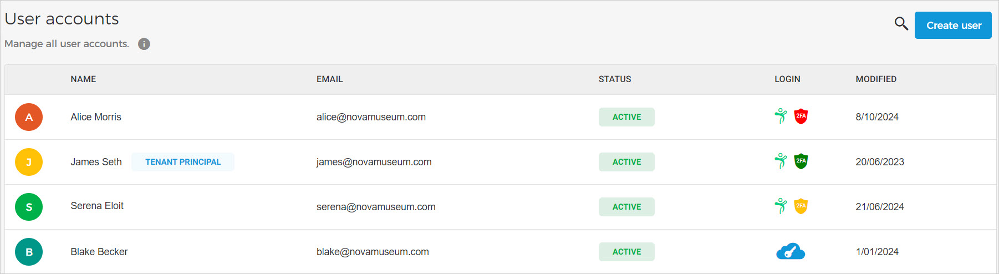
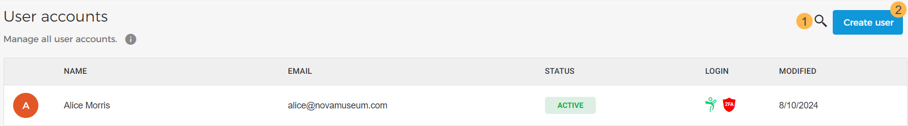

### Consult users

On the page you can consult the list of users using Envsio in your organisation.

The user that was first registered on Enviso will be marked as the 'Tenant principal' and will have all the permissions of the Enviso apps. You can also change the Tenant principal user by transferring the ownership.

#### Status

The column Status allows you to determine the status of a user's Enviso account.

means the user has activated their account using the activation link sent to them automatically at the time of user creation.

suggests that the user's account was created in Enviso, but the user has not yet activated it by clicking on the activation link sent to his/her registered email

The user's account is deactivated.

#### Login

The column Login suggests which method the user uses for logging in to Enviso.

Indicates the user logs in Enviso using Enviso credentials. Additionally, the two-factor authentication (2FA) status is also shown for the user.

The following three statuses are possible for 2FA:

Indicates 2FA is enabled

Indicates 2FA is not configured yet

Indicates 2FA is disabled

See further: [Two-factor authentication](UUID-91329744-a6f0-4e93-e3b7-7f913d181def.html)

Indicates the user logs in Enviso with single sign-on (SSO).


![[Note]](media/note.png)
If you wish to use sign-on (SSO) for Enviso login, contact [Vintia support](https://vintia.atlassian.net/servicedesk/customer/portal/8) .


![[Note]](media/note.png)

#### Search and create users

1. The search bar allows you to search for a user by the user's first and last name.

2. Using the button in the top-right corner of the page, you can [create a new user](UUID-c3885bbd-a7e7-986c-8904-f7af1902ec63.html) .