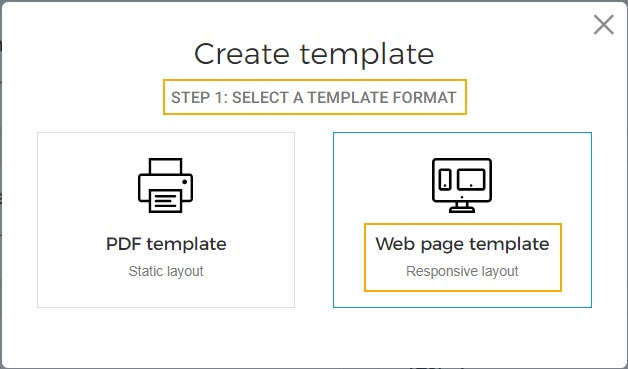

#### Types of product templates

##### Standard size template

A standard size template is an A4 size template that can be used for tickets as well as memberships.

Once published, the standard-size templates are [linked with tickets/memberships](UUID-06b0ac05-14d9-df41-a1e4-15f60c2f16c3.html) .

Anyone template must be defined as a default template. The [default template](UUID-863c9d70-1b9a-dd88-b398-bed9f2daab8c.html) will be used when no template is linked to a ticket/membership type.

The published standard-size templates are available to both, the direct and indirect channel sales points.

##### Custom size templates

Define the custom height and width of a template for tickets as well as memberships.

Once published, the custom-size templates are linked with direct channel sales points.

The visitor will receive PDF ticket/membership in the customised size when purchased from the defined onsite [sales points](UUID-91020bd8-3f00-8d7f-fefb-24516a78c0fa.html) .

No need to define a default template.

To communicate with the onsite sales points, integration with the Direct selling API is required.

##### Responsive

It is a web page template with a responsive layout.

Using a responsive template, you can deliver tickets and memberships to your customers as a web page link that they can open on their mobile devices.

When [creating a template](UUID-eb8f03b9-d66f-e6ec-480c-2cf471c3f61f.html) , there will be an additional step to choose either a static PDF layout or a responsive web page layout. Choose to create a responsive layout.

For a responsive template, [setting a template as default](UUID-863c9d70-1b9a-dd88-b398-bed9f2daab8c.html) works slightly differently.

At the time of placing the order, if a Standard template was set as default, the ticket/membership will be delivered as a PDF. Later if a responsive template is set as default, that ticket/membership will still be available as a PDF and not a web page link from (more options menu corresponding to the order).

In case a product template is available in :

If a ticket/membership has already been generated in PDF for, for example, English and later a responsive template is set as default, then, the ticket/membership will still be available as a PDF for the English language (and not as a web page link).

However, for other languages, the ticket/membership will be available as a Pass link (a web page link).

For responsive product templates, you can [set background image](UUID-f8c7d410-6006-0d25-6224-d99f00fa306a.html) that will show as a banner image for the tickets and memberships delivered as a web page.

It is possible to [create new templates](UUID-eb8f03b9-d66f-e6ec-480c-2cf471c3f61f.html) , either from scratch or by customising the default template provided by Vintia. Once created, it is not possible to delete a product template.

You can [add translations](UUID-5320ad87-921d-ee72-df1e-273e1e1dfba5.html) for standard-size as well as custom-size product templates.