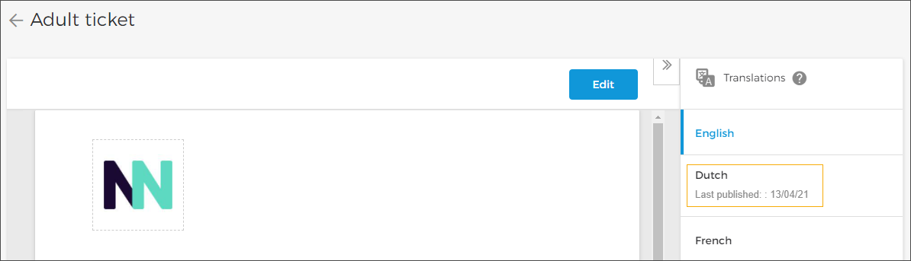

### Add translations for Email/Product template

The Translations panel on the right side of the Email/Product template page allows you to add translation strings for the languages that are pre-added from [Settings](UUID-1a87163e-7e23-23aa-7d84-99af6b05e868.html) . From the Translations panel, select the language for which you want to add translations. Thereafter, click .

From the Translations panel, for which you want to add translations. Thereafter, click .

Next, the ticket editor will open. Note the language is specified next to the template name.

In the template editor window, replace the text strings with translations.


![[Note]](media/note.png)
The text between the brackets are fields where dynamic data will appear. These require being translated.


![[Note]](media/note.png)

Thereafter, you can either save the translations as draft or publish the ticket template with the updated translations.

On the Ticket/Email template page, you will be able to see the date when the template was last published with updated translations.


![[Note]](media/note.png)
When placing an order suppose the visitor chooses a language for which translation is not added, email/ticket template of the English language will be used.


![[Note]](media/note.png)

The language(s) in which the template has been published will show on the template card.

