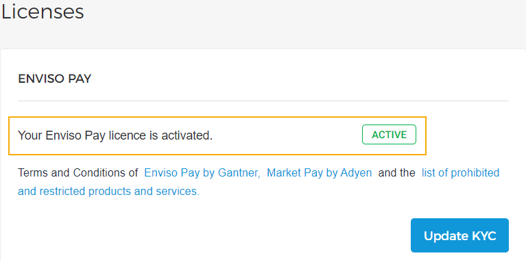

## Licenses

In the section Licenses, you can onboard for using Enviso Pay for payments.

To begin with, you will first need to contact [Vintia support](https://vintia.atlassian.net/servicedesk/customer/portal/8) . They will carry out the back-end process to enable you to create an account with the payment services provider, Adyen.

Once that is done, Vintia support will contact you to visit the Licenses page again. This time, you will see the button. Clicking on the button will navigate you to the Adyen website, where you will be required to enter the required details. Thereafter, Adyen will verify the provided details.

On the Licenses page, you can consult a detailed KYC status for each verification check such as identity check, company check, bank account check and photo ID check. The KYC is a process to validate and verify your organisation details related to the regulations regarding payment processing.

Once all the checks are cleared, the status will be visualised. Thereafter, your customers will be able to make payments using Enviso Pay for orders placed through your direct channel sales points.


![[Note]](media/note.png)
Integration with Direct selling API and/or Ticketing Widget is required for selling offers through direct channel sales points.


![[Note]](media/note.png)

### Editing the KYC details

Once your Enviso Pay license has been activated, it is possible to edit the KYC details such as changing the organisation's details, adding a new bank account and so on.

Click . You will be redirected to the KYC page on Adyen to make the changes. The moment the KYC details are changed, the verification process will be triggered again. For example, if a new bank account is added, you will need to upload the documents to verify
the account.

![[Warning]](media/warning.png)

The until the updated KYC details are verified. However, while the updated KYC details are being verified, your customers will be able to make uninterrupted payments.