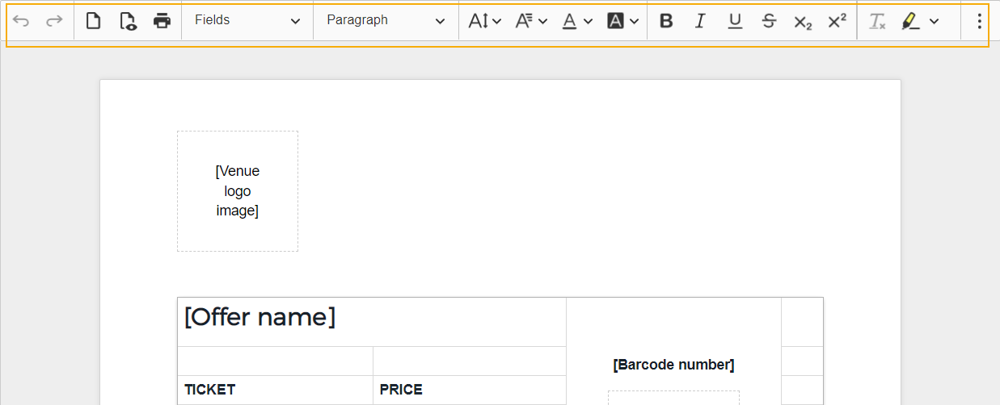
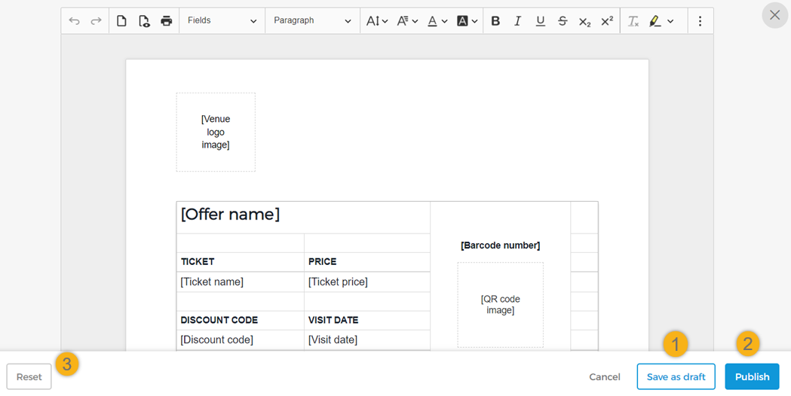
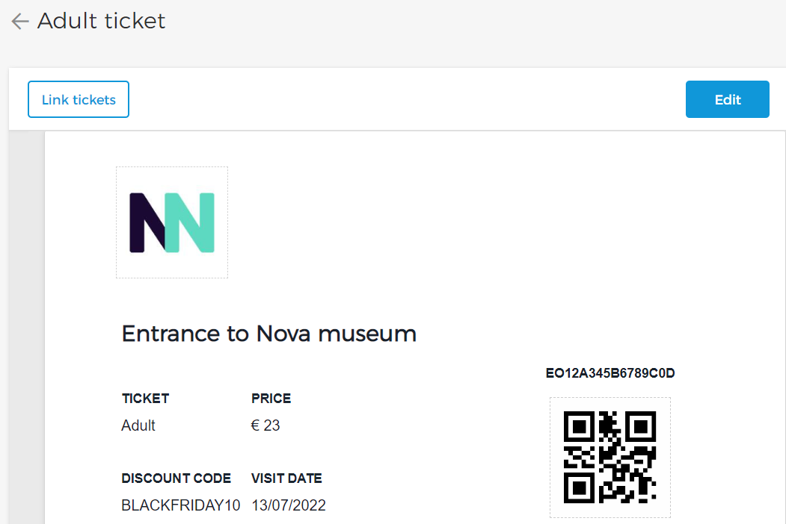

#### Edit product template

It is possible to edit the template name and customise the template using the template editor. For a Custom size ticket template, you can additionally edit the height and width of the template.

Using the tool panel on the template editor, you can customise the template.

You can add more fields from the drop-down.

For the 'Fields' options that have height and width parameters, if you define measurement for one parameter and define the other as auto, the other parameter will automatically take its appropriate measurement as per the screen size when the ticket is downloaded.

You can preview the email template using the button in the toolbar.

After customising the template, you can either save the template as a draft, publish it or reset the changes made.

If the changes have been saved as draft, the template will be flagged as Unsaved draft version on its detail page.

Allows you to publish the template. See further [Publish product template](UUID-3ac6ae3d-9dec-a704-bcdc-36a4c9a315b1.html)

If you wish to revert to the default template provided by Vintia, use the button at the bottom of the template editor.


![[Note]](media/note.png)
Vintia makes periodic enhancements in the system template. To make use of the latest changes in the System template, please reset the template.


![[Note]](media/note.png)

Note that initially, a default template preview is shown on the detail page of a template. Later when the modifications made using the template editor are published, the preview is updated with the most recently modifications.

Now when you revisit a ticket template, you will be able to [link tickets](UUID-06b0ac05-14d9-df41-a1e4-15f60c2f16c3.html) for a Standard size (A4) template and and [link sales points](UUID-85e7dbf1-19e4-fed4-9fa3-28a4f6f7dc13.html) for a Custom size template. You can also [add translations](UUID-5320ad87-921d-ee72-df1e-273e1e1dfba5.html) for the templates.