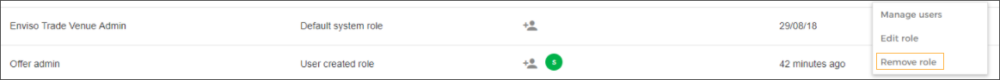

### Remove a role

It is possible to remove roles that are created on Enviso Admin. Default user roles cannot be removed.

![[Caution]](media/caution.png)

A user with no roles assigned will not be able to access the Enviso apps.