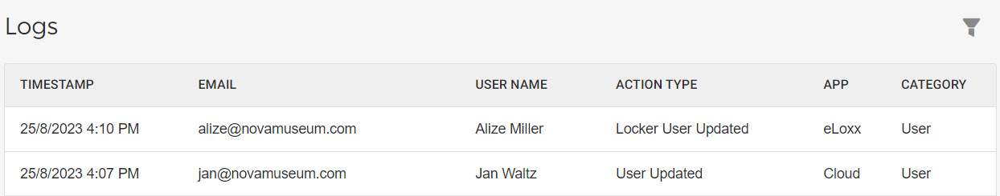
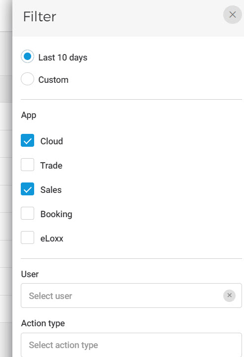
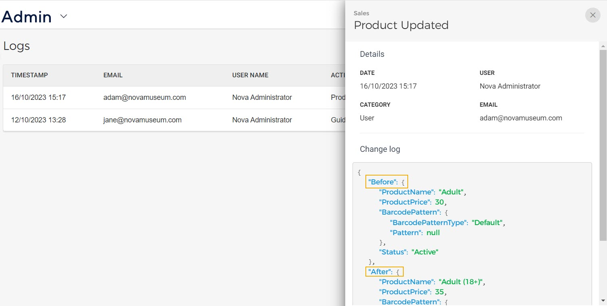
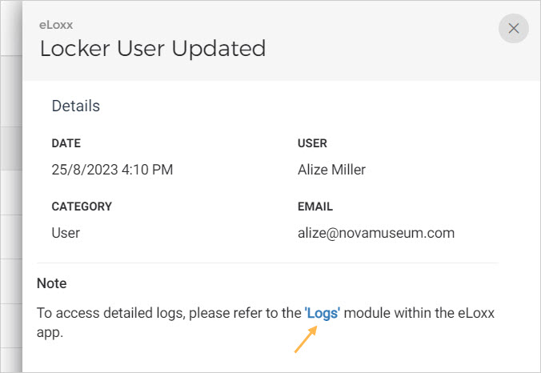

## Logs

On the Logs page, you can consult the activity log of the users using the Enviso apps in your organisation. This is for all the tenants - Venues, Resellers, Cities and Locker sites.

### Filter logs

It is possible to filter user logs based on duration, Enviso app, user, and action type.

### Log details

Click on a log to consult its details. Based on the action type, you can consult the activity details.


![[Note]](media/note.png)
To consult the activity log for eLoxx app, you will be navigated to the eLoxx app.


![[Note]](media/note.png)

