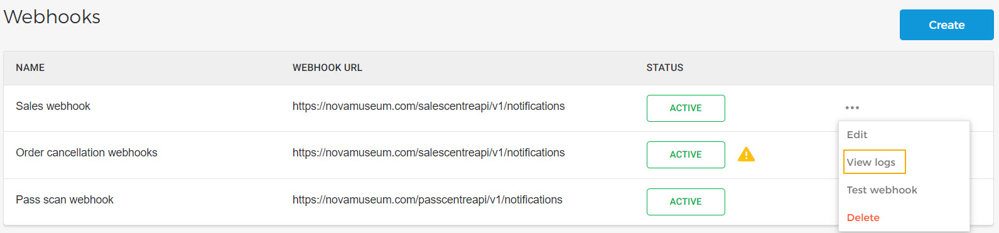
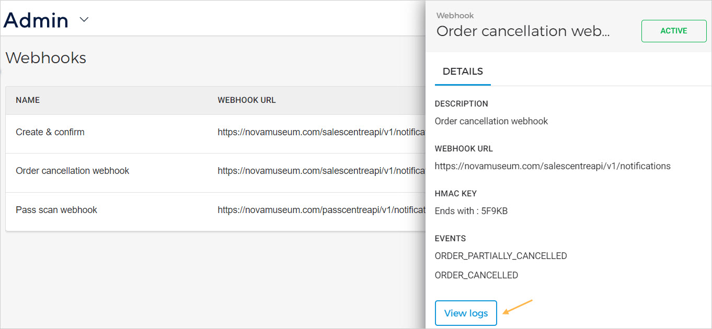
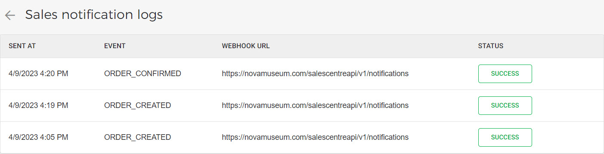
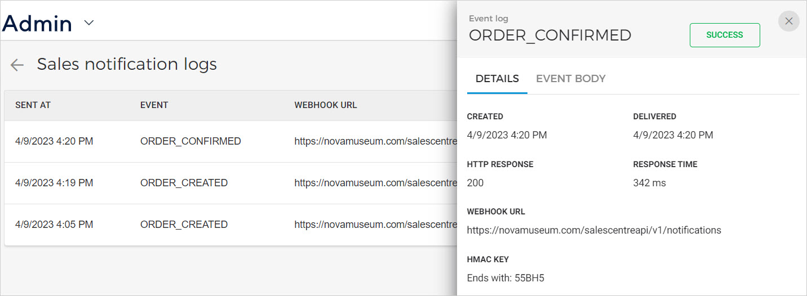
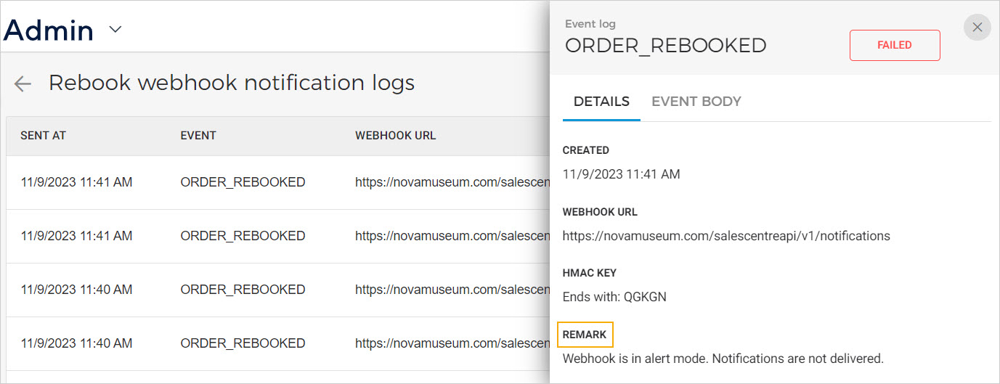

### Webhook notification logs

From the webhook page, you can consult the notification logs for the Webhook.

Alternatively, you can view notification logs from the side panel containing the webhook details.

On the webhook notification log page, you can consult the logs along with their delivery status.

Click on a notification log to view more information from the tabs and .

When the system fails to deliver notifications through webhook, the system will auto-retry to deliver the failed notification. The Venue user can consult the remark in the log details.

