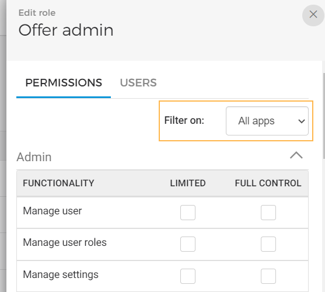
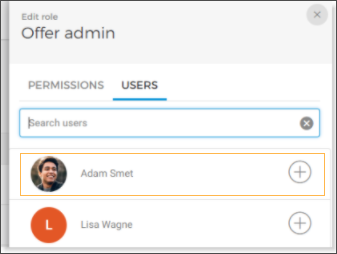

### Add a role

Go to . On the page , click .

In the resulting pop-up, enter the role name and click .

Note the left menu appears for configuring permissions and adding users to the new role.

In the side menu, under the tab it is possible to configure permissions for the role. You can filter apps for which you wish to define permissions. Depending on your license for an Enviso app, you will be able to filter the permission options.

From the tab , you can assign users to the role. Click on the search bar. A list of users will appear. Add users and click .

