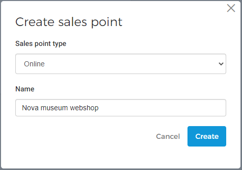
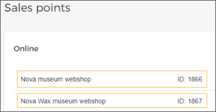

### Create a sales point

If sales points are synchronized from Recreatex, you will have the option to create your own onsite and online sales points in Enviso.

Click in the top-right corner of the Sales points page.

In the resulting pop-up, select the sales point type. Thereafter, enter the name of the sales point and click .

When you create a sales point, a unique ID is generated for it.

Using this sales point ID, [Vintia support](https://vintia.atlassian.net/servicedesk/customer/portal/8) can help you integrate various Enviso apps and widgets.