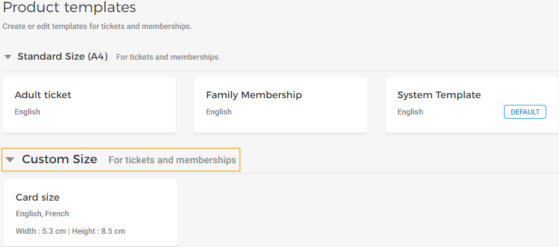
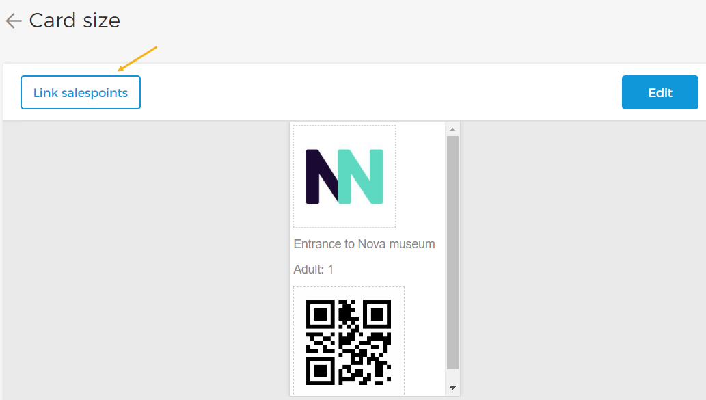
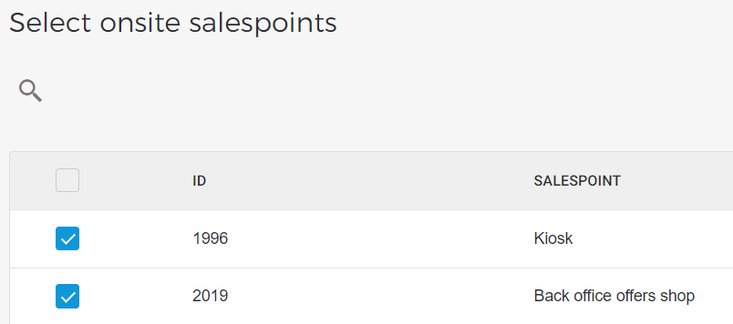
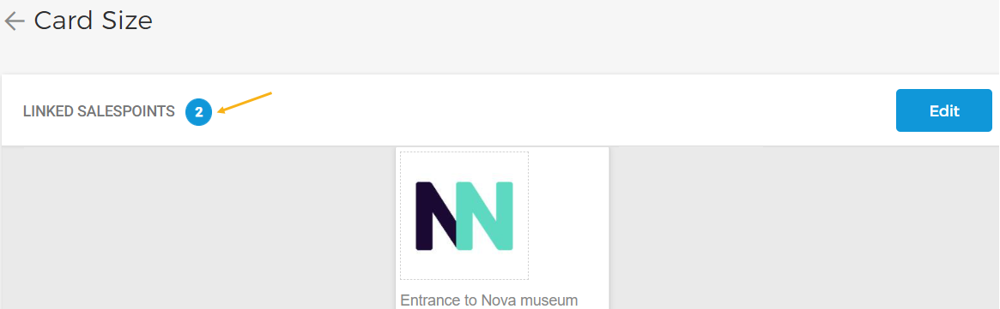

#### Link sales points


![[Note]](media/note.png)
The option to link a template with onsite sales points is available only for .


![[Note]](media/note.png)

Once you have published a Custom size template, you can link it with the onsite sales points. The visitor will receive PDF tickets/memberships in the customised size when purchased from the defined onsite sales points. In this case, the custom template will over-write any standard-size template defined at offer-level.

On the page, click on a Custom size template you want to link with one or more onsite sales points.

On the resulting page, click in the top-left corner of the preview panel.

Next, select the [onsite sales points](UUID-91020bd8-3f00-8d7f-fefb-24516a78c0fa.html) where you wish to use the Custom size template.

Click in the bottom-right corner of the window to link the selected onsite sales points with the template.

Next, on the template preview page, you will be able to see the number of linked sales points.

You can also [add translations](UUID-5320ad87-921d-ee72-df1e-273e1e1dfba5.html) for the template.