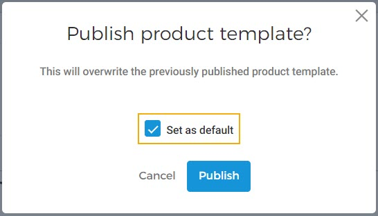
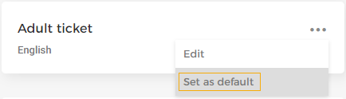
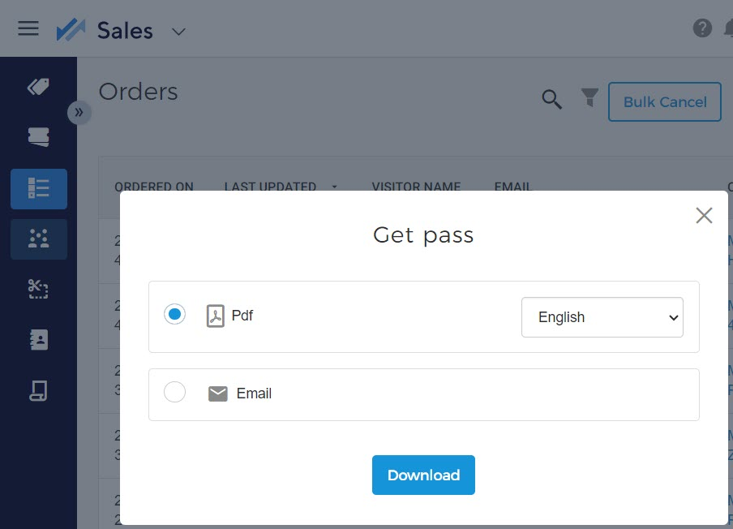
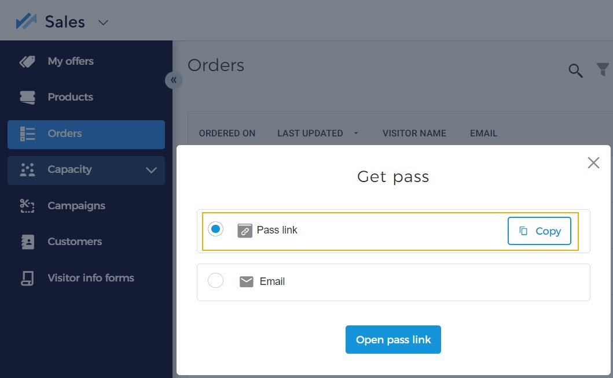

#### Set a template as the default

It is possible to set a Standard-size PDF template or a [Responsive template](UUID-5156baa7-4d9b-d8e9-fcd0-7e3052a3906a.html#UUID-5156baa7-4d9b-d8e9-fcd0-7e3052a3906a_section-idm4517193403729633750335349604) as default. This can be done in either of two ways:

At the time of publishing a template from the Edit template page.


![[Note]](media/note.png)
If a template is the only template or is already marked as the default template, the option to set the template as default will be disabled in the 'Publish product template' pop-up.


![[Note]](media/note.png)

From the more options menu on a template card.

##### Important to know:

In case [Responsive template](UUID-5156baa7-4d9b-d8e9-fcd0-7e3052a3906a.html#UUID-5156baa7-4d9b-d8e9-fcd0-7e3052a3906a_section-idm4517193403729633750335349604) is enabled for your Venue, setting a template as default works slightly differently.

The default Standard-size PDF template will not apply when a [product is linked](UUID-06b0ac05-14d9-df41-a1e4-15f60c2f16c3.html) to a Standard-size PDF template.

When a product is linked to a [Responsive template](UUID-5156baa7-4d9b-d8e9-fcd0-7e3052a3906a.html#UUID-5156baa7-4d9b-d8e9-fcd0-7e3052a3906a_section-idm4517193403729633750335349604) , the default Standard-size PDF template will apply instead of the linked Responsive template.

The default Responsive template will not apply when a product is linked to a [Responsive template](UUID-5156baa7-4d9b-d8e9-fcd0-7e3052a3906a.html#UUID-5156baa7-4d9b-d8e9-fcd0-7e3052a3906a_section-idm4517193403729633750335349604) .

When a product is already linked to a Standard-size PDF template, the default Responsive template will apply instead of the linked Standard-size PDF template.

At the time of placing the order, if a Standard-size PDF template was set as default, the ticket/membership will be delivered as a PDF.

Later if a Responsive template is set as default, that ticket/membership will still be available as a PDF and a web page link from (more options menu corresponding to the order).

In case a product template is available in :

If a ticket/membership has already been generated in PDF for, for example, English and later a Responsive template is set as default, then, the ticket/membership will still be available as a PDF for the English language (and not as a web page link) from

However, after changing the default template to a Responsive template, when you choose another language, for example, Dutch, and click for [Get pass](https://help.vintia.com/enviso/en/134879-135243-get-pass.html) , the ticket/membership will open as a web page in another tab.

Now going back to the Sales app, you will see the option to copy the pass link or open it in a browser.

