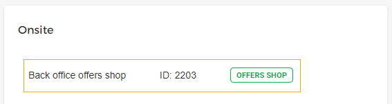
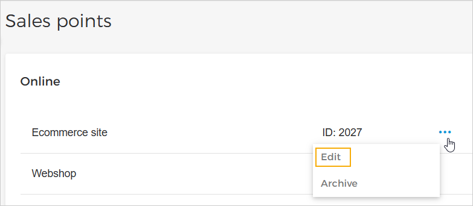
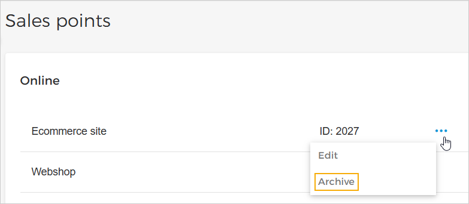

## Sales points

From the page Sales points, you can consult the online and onsite sales points that have been integrated from Recreatex with Enviso. However, if sales points are not synchronized from Recreatex, you will have the possibility to [create sales points](UUID-81c20560-7298-4258-bea8-343152772ff3.html) in Enviso.


![[Note]](media/note.png)
The page Sales points is available only for the venue users. The user should have [permission](UUID-80203675-f81e-998f-d13e-b61d4d3d5dc2.html) to 'Manage sales point'.


![[Note]](media/note.png)

The 'Back office offers shop' is the default sales point and cannot be archived.

### Edit sales point

On the Sales points page, click on the more options button corresponding to the sales point you wish to edit. Therearfter, from the drop-down menu, select .

In the resulting pop-up, you can rename the online sales point.

The sales point ID is automatically generated by the system and cannot be edited.

It is not possible to delete a sales point.

### Archive sales point

On the Sales points page, click the more options button corresponding to the sales point you wish to archive. Thereafter, from the drop-down menu, select .


![[Note]](media/note.png)
When a sales point is archived, the assigned capacity to the sales point will be removed from all the offers.


![[Note]](media/note.png)