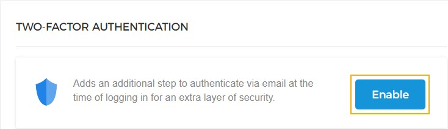

### Two-factor authentication (2FA)

 Two-factor authentication (2FA) is a method to double-check that the user's identity is legitimate. It provides stronger protection against unauthorised account access.

A user with can implement two-factor authentication in either of the two ways:

globally and make it to log in with 2FA.

and make it for the users to log in with two-factor authentication.

An individual user will be able to log in until they enable 2FA on their account. See further [2FA mandatory](UUID-91329744-a6f0-4e93-e3b7-7f913d181def.html#UUID-91329744-a6f0-4e93-e3b7-7f913d181def_section-idm457201438245443360548762264)

by the Super Admin makes it for all users to enable 2FA for their individual accounts. So when the  Super Admin disables 2FA, the users will have to manually disable 2FA for their accounts.

We recommend that the Super admins so that the users are informed about the change in the login process.

In this case, after entering the account credentials, the user will have to enter the verification code sent to the user's registered email address. For a detailed description, refer [2FA Mandatory](UUID-91329744-a6f0-4e93-e3b7-7f913d181def.html#UUID-91329744-a6f0-4e93-e3b7-7f913d181def_section-idm457201438245443360548762264)

and is for the users to log in with 2FA

In this case, when the user logs in for the first time, s/he will have the option to enable two-factor authentication and log in using account credentials and a verification code.

If the user skips enabling two-factor authentication at the time of logging in, s/he can enable it from the [profile page](UUID-a969751f-e2b4-aef0-c587-fa9dbbe27807.html) in their account.

For a detailed description, refer [2FA Optional](UUID-91329744-a6f0-4e93-e3b7-7f913d181def.html#UUID-91329744-a6f0-4e93-e3b7-7f913d181def_section-idm4593856838819233605485975628)

#### 2FA Mandatory for all the users

As an Enviso super admin, if you wish to make it mandatory for all the users to log into their Enviso account using their credentials and a verification code, then enable the parameter Two-factor authentication ( ).

If not already enabled, a confirmation pop-up will appear, wherein you will need to enter your venue's name exactly the way it was entered at the time of registration. This is to ensure that two-factor authentication is not enabled or disabled accidentally.

Enter the venue name exactly the way it was entered at the time of registration, including uppercase/lowercase characters.

For the exact venue name, you can refer to the venue name that shows at the bottom of the left menu.

When two-factor authentication is enabled, the login procedure for all the users of the venue will be as follows:

On the login screen, the user enters their Enviso account credentials.

The user enables two-factor authentication.

The user enters the verification code sent to his/her email address registered on Enviso.

If the verification code has expired, the user can click 'Resend code' to get a new verification code.

Upon successful validation, the user can access his/her account.

For the subsequent login, after the user enters his/her credentials, the user will have the option . If selected, the user will not be prompted to re-authenticate with a verification code for the next 30 days.

On the user's [profile page](UUID-a969751f-e2b4-aef0-c587-fa9dbbe27807.html) , 'Two-factor authentication' will show enabled.

#### 2FA Optional

As a venue user, if you do not wish to make two-factor authentication mandatory for all venue users, you can disable it from .

 If not already disabled, a confirmation popup will appear, wherein you will need to enter your venue's name exactly the way it was entered at the time of registration. This is to ensure that Two-factor authentication is not enabled or disabled accidentally.

Enter the venue name exactly the way it was entered at the time of registration, including uppercase/lowercase characters.

For the exact venue name, you can refer to the venue name that shows at the bottom of the left menu.

 When two-factor authentication is disabled, the login procedure for the venue users will be as follows:

On the login screen, the user enters their Enviso account credentials.

The user has the option to two-factor authentication or enabling it right away.

Depending on the user's choice, the next step will be:

If the user , the user will have to enter the verification code sent to his/her email address registered on Enviso.

By clicking 'Resend code',  the user can request a new verification code in case the code has expired.


![[Note]](media/note.png)
For the subsequent login, the user will have the option . If selected, the user will not be prompted to re-authenticate with a verification code for the next 30 days.


![[Note]](media/note.png)

3.2: If the user chooses , the user will be able to log in with just the valid credentials. Later, the user will be able to enable/disable two-factor verification from his/her [profile page](UUID-a969751f-e2b4-aef0-c587-fa9dbbe27807.html) .

#### Consult 2FA status

From the [User accounts](UUID-c3885bbd-a7e7-986c-8904-f7af1902ec63.html) page, is possible to consult whether users have enabled, disabled, or not yet configured two-factor authentication (2FA) for their Enviso account.

