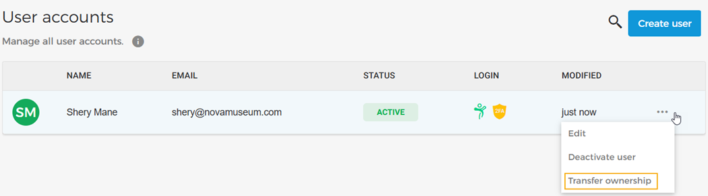
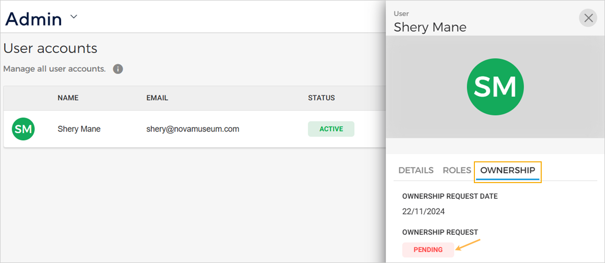
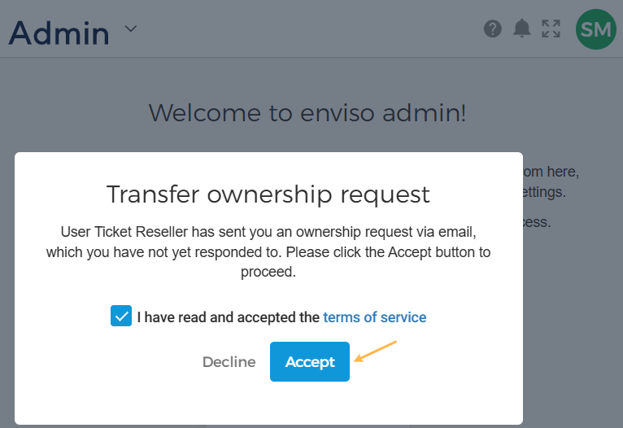
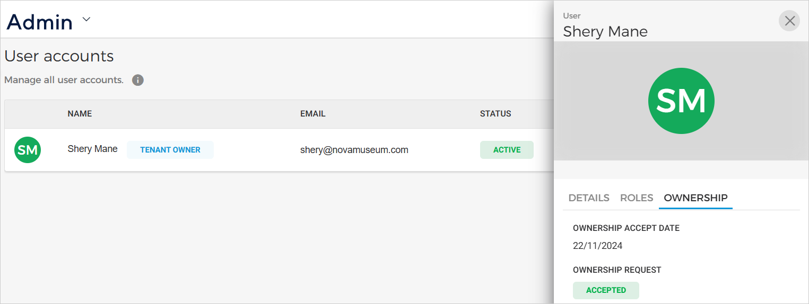
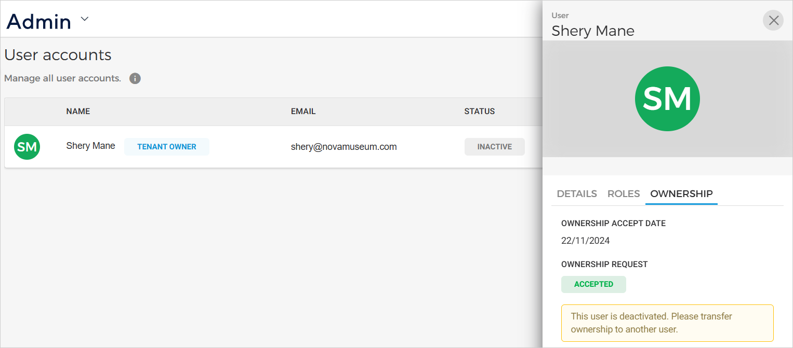

### Transfer tenant ownership

By default, the user who registered their organisation on Enviso becomes the tenant owner. However, venue and locker users can transfer ownership of being the tenant owner to another user.


![[Note]](media/note.png)
The feature to transfer ownership is available to venue and locker users only.


![[Note]](media/note.png)

On the User accounts page, click the more options button for a user with a Super Admin role. Click on the option . The option to transfer ownership will appear only if the user has a Super Admin role.

In the resulting pop-up, confirm the transfer of ownership to the user.

Please note that in the user's detail section, you will see the ownership request status as 'Pending' under the tab . You can also consult the date when the transfer ownership request was sent to the user.

Next, the user to whom the transfer ownership request has been sent can accept or decline the request. The ownership request can be accepted or declined from the email sent to the user or from his/her Enviso account.

If the user has accepted the transfer ownership request, the user will show as the Tenant owner in Enviso Admin.

If a request for transfer ownership is pending and a new request has been sent to another user, the request sent to the previous user is cancelled automatically.

A user with Enviso Super Admin role can deactivate a user who is the tenant owner. We recommend transferring ownership to another user after deactivation.

