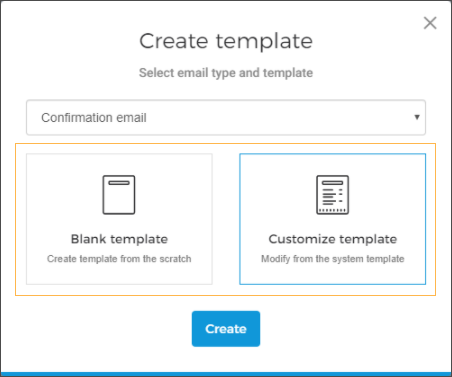
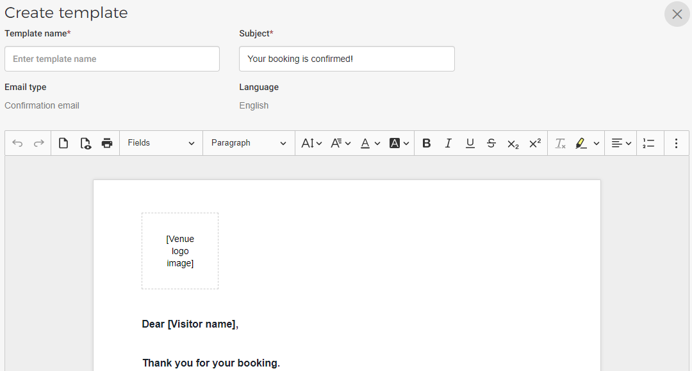

#### Create email template

On the Email template page, click in the top-right corner.

This will result in the Create template window. First, select the email type for which you wish to create a template.

Thereafter, select to either create an email template from scratch or customize the existing system template.

Clicking on will navigate you to the template editor window.

Next, enter a name for the template. The Subject field is pre-filled. However, you can change it as required.

Note that the language selected is English. This is because a template is by default created in English. Later on, it is possible to add translations for it in multiple languages. Refer, [Add translations](UUID-5320ad87-921d-ee72-df1e-273e1e1dfba5.html)

Next, using the editing tools, you can make changes to the template. For a detailed description, refer [Edit email template](UUID-f5363fc5-251f-8654-10ce-aa4a5b2831eb.html)