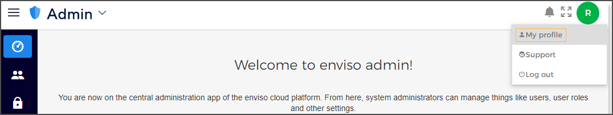
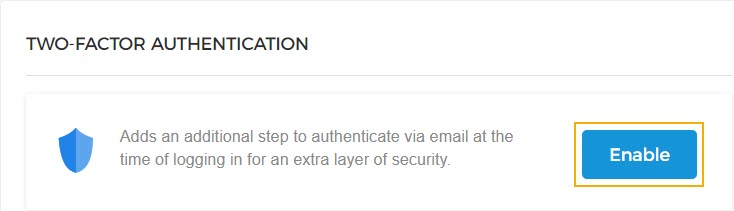
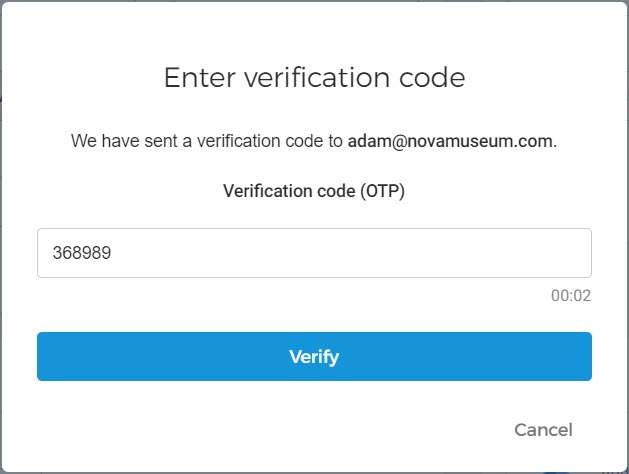
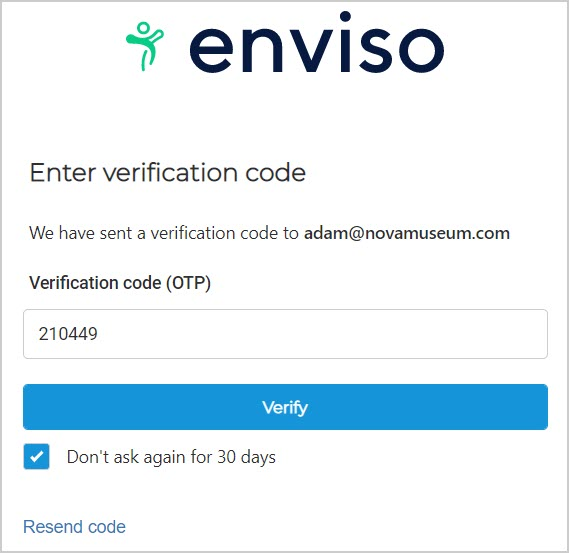
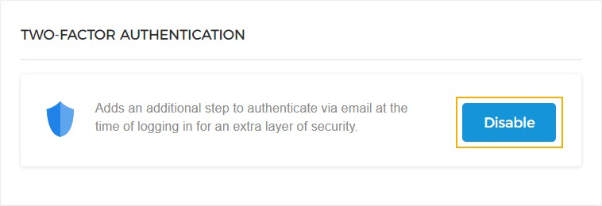
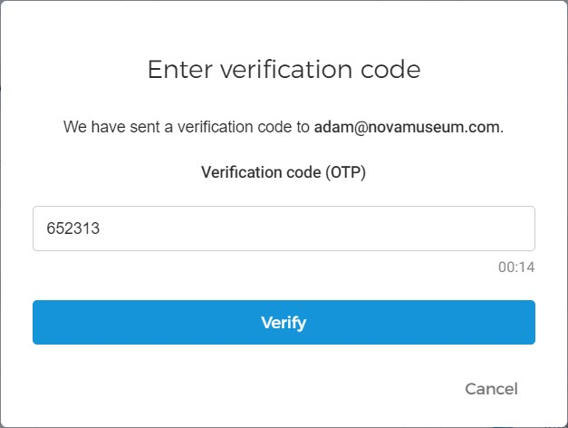

## Managing profile

On the extreme right of the top panel, you can see the name of the user that is currently logged in.

Click on the user name to view or edit the profile information.

On the user profile page, you have options to change settings for the profile of the logged-in user.

Account Info

It is possible to edit the first name, last name, phone number, and profile picture of the user.

By default, the initial of the user's first name will show as the profile picture.

To change the user profile picture, click and upload a profile picture for the user.

Security

It is possible to change the user password. Enter your current password and the new password. Re-enter the new password to confirm. Click to set the new password.

Localization

It is possible to change the user language from English, Dutch, French and German.

The default language is English. In case the language defined for the browser used for accessing the trade for resellers portal is Dutch, then the application will be displayed in Dutch.

Two-factor authentication

By default, two-factor authentication is disabled for all users. To use two-factor authentication for your individual account, click .

Next, you will be prompted to enter a verification code sent to your registered email account. This is to ensure that two-factor authentication is not enabled accidentally.

Now, upon subsequent logins, you will be additionally required to enter a verification code sent to your registered email address.

For more details, refer [two-factor authentication](UUID-91329744-a6f0-4e93-e3b7-7f913d181def.html)

By default, two-factor authentication is disabled for all users. If you have previously enabled it, you will have the possibility to two-factor authentication.

Next, you will be prompted to enter a verification code sent to your registered email account. This is to ensure that two-factor authentication is not disabled accidentally.

Now, upon subsequent logins, you will be able to log in with only your Enviso credentials. The additional step to re-authenticate with a verification code will not appear.