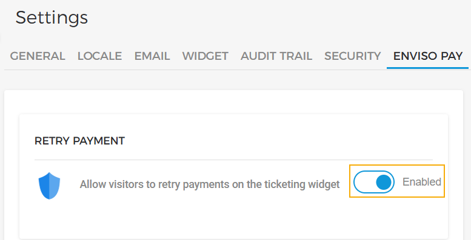
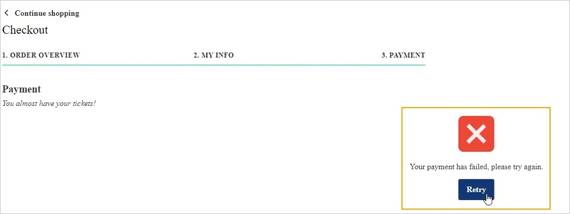
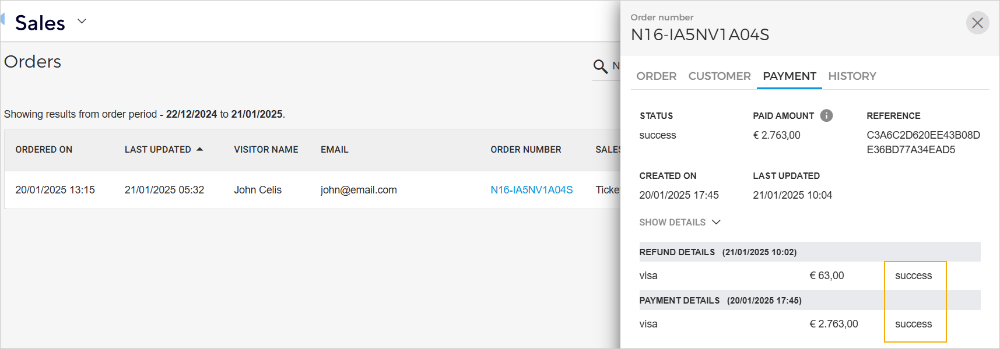
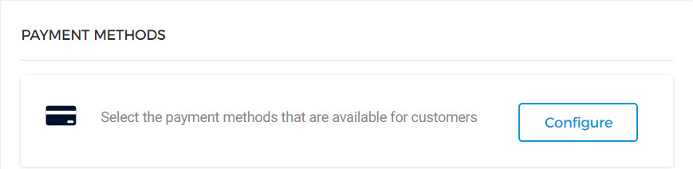
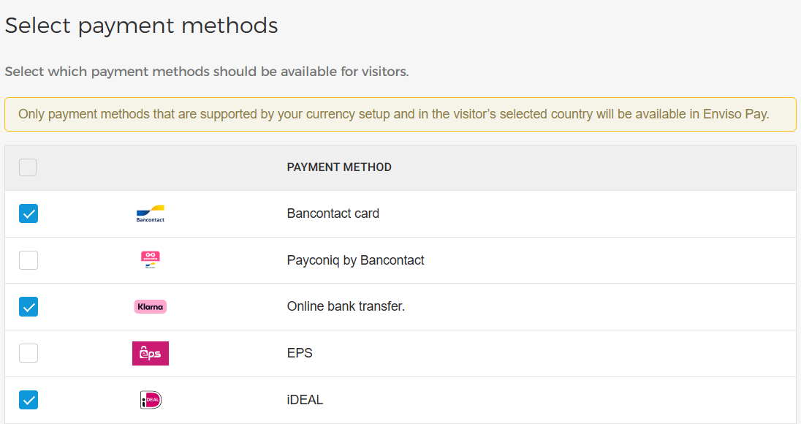
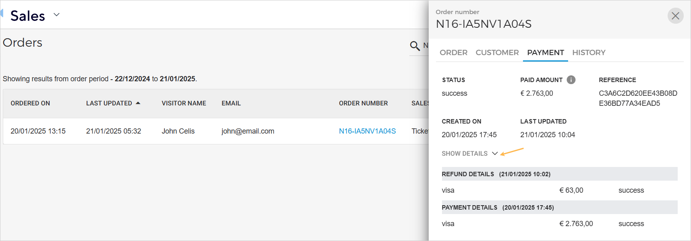

### Enviso Pay


![[Note]](media/note.png)
The tab Enviso Pay is available to only. You can request [Vintia support](https://vintia.atlassian.net/servicedesk/customer/portal/8) to enable this feature for your venue.


![[Note]](media/note.png)

#### Retry payment

If , customers on the Ticketing widget can retry payment when the payment transaction is not successful (instead of having to place the order again).

The customer will have the option to retry making the payment without having to add offers to the basket again.

The multiple payment attempts and their status can then be consulted on the Orders page in the Enviso Sales.

#### Payment methods

It is possible to configure the payment methods that are available to customers on the Ticketing widget.

Clicking on , you will be redirected to the page to select payment methods.

![[Warning]](media/warning.png)

The selected payment method will be available in Enviso Pay if:

The payment method is not supported in the country selected by the visitor.

The payment method does not support the currency configured for Enviso.

![[Warning]](media/warning.png)

While deselecting payment methods, please be aware that the available payment methods differ between countries.

If too many payment methods are deselected it is possible that there won't be any payment method available for that country.

Once configured, the customer can choose to split the payment between multiple payment methods.

The selected payment method(s) can be consulted from .

