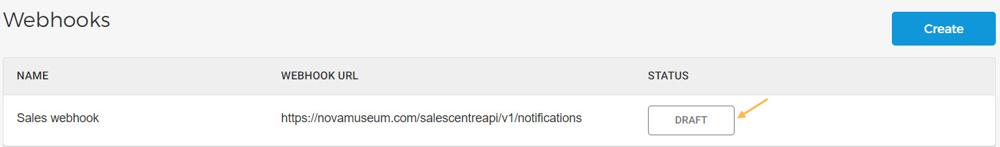

### Create a webhook

On the Webhooks page, click in the top-right corner.

Thereafter, on the page you can configure the webhook.

#### Details

##### General

Webhook name

Enter the name of the Webhook, that will show on the Webhooks page.

Description

Enter a description of what the webhook is created for.

Webhook URL

Enter the URL to which an HTTPS request will be sent when the selected events occur. The events can be selected from the tab Events.


![[Note]](media/note.png)
The webhook URL must be unique. It is not possible to create webhooks with the same URL.


![[Note]](media/note.png)

##### Security

HMAC key

Click to generate the HMAC key for secure communication.

For the generated key, you will have the option to copy it.

The generated key is shown until the webhook is saved. After that if you wish to edit the webhook, it will be possible to retrieve the HMAC key. Instead, you will need to the key.

#### Events

Click to select the events that the webhook should track.

Next, you will be redirected to the page where you can select one or more events that the webhook should track.

The events are categorised as per Enviso apps - eLoxx, Sales, and Booking. You can also search for a specific event. Once selected, click .


![[Note]](media/note.png)
The rebooking order will be confirmed once the payment for the additional cost is completed. However, it will be cancelled if the payment fails.
The rebooking order will be automatically confirmed if there is no additional cost for rebooking.


![[Note]](media/note.png)

Thereafter, you will be able to consult the selected events. To remove a selected event, click the delete icon.

The created webhook can be .

Next, you will need to [test the webhook](UUID-842af4ea-b150-c5e3-be37-89290a061fc2.html) configuration. If successful, you will be able to activate the webhook.


![[Note]](media/note.png)
It is possible to create a maximum of webhooks.


![[Note]](media/note.png)