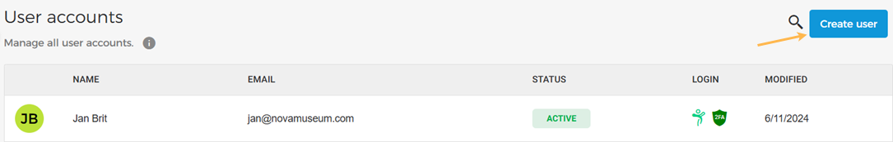
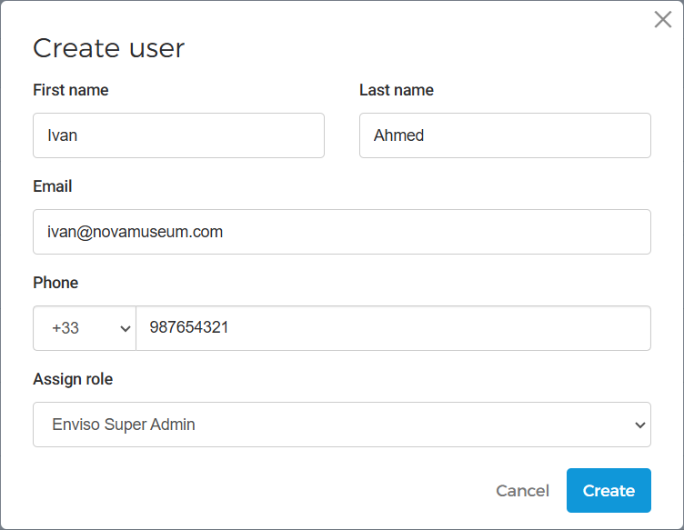
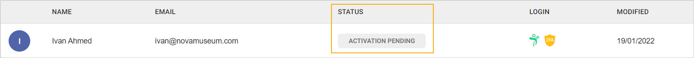
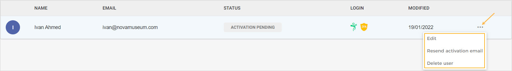
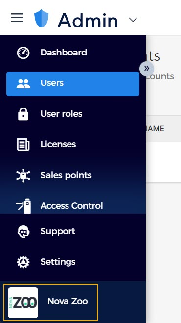
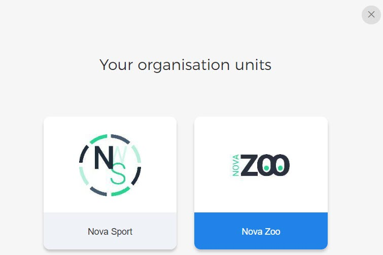

### Create a user

On the top-right corner of the User accounts page, click to create a new user.

In the resulting pop-up, enter the user details and assign a role.

Next, the user will need to activate his/her account by following the account activation procedure sent to his/her email. Until then, the user will be marked with the status Activation pending.

Once the user has activated his/her account, the status will change to Active. Once activated, the user can log into his/her account to add a photo and manage other profile settings.


![[Note]](media/note.png)
The option to create a new user and add roles will be available depending on the permissions granted to the user.


![[Note]](media/note.png)

From the more options button, you can edit the user details and user roles, resend the activation email and delete the user.

#### Creating a user for multiple venues

If there are multiple venues in your organisation, it is possible to switch to another venue and create new users for it.

To switch a venue, click on the venue icon at the bottom of the left panel.

Next, you will see the venues that are added to your organisation. Select the venue you wish to switch.

Once switched, you will see the venue's logo at the bottom of the left panel.

Now go to and follow the procedure to [Create a user](https://help.gantner.com/enviso/en/140073-140140-creating-a-user.html#140073-140140-creating-a-user) .


![[Note]](media/note.png)
The Email entered at the time of [registering on Enviso](https://help.gantner.com/enviso/en/134879-135195-register-on-enviso.html) , will by default have the Super Admin role for multiple venues of the organisation.
Only those users with the Super Admin role can switch venues and create new users for other venues of the organisation.


![[Note]](media/note.png)