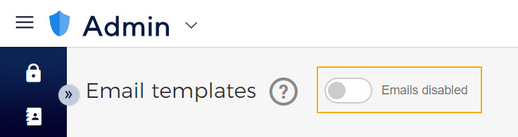

### Email templates

The page allow you to [create](UUID-a28308f5-6d75-acd7-f3a2-f4ea015072ab.html) and manage email templates for multiple events. You can mark a published template as default for each of the email types. For a detailed description, refer to [the Set template as default](UUID-e472fcd7-00b4-b23b-86e6-fbcc9d9be9f9.html) . It is also possible to add translations for a template. Refer [Add translations](UUID-5320ad87-921d-ee72-df1e-273e1e1dfba5.html)


![[Note]](media/note.png)
The configured email templates will be sent only for orders placed on your .


![[Note]](media/note.png)

Moreover, it is possible to disable sending sales-related emails from Enviso to the visitors using the option.

If disabled, these emails will not be sent to the visitors from Enviso - order reservation, order confirmation, order cancellation, payment failure, rebooking, membership expiry reminder, post-visit and pre-visit emails.

Other emails related to admin will still be sent from Enviso. This includes emails related to password change, emails sent to guides, and so on.

#### Email events

Email event

Description

Reserved order

Email sent to the visitor when order is reserved on the venue's [Offer shop](https://help.gantner.com/enviso/en/134879-228662-selling-on-offers-shop.html) .

If you use Enviso Pay for payments, you can send a payment link to the visitor along with the order reservation email. For this, you will need to configure the field 'Payment link' in the reserved order email template.

Confirmed order

Email sent to the visitor when an order is placed on any of the direct channel sales points is confirmed.

Once published, a confirmation email template can be [linked](https://help.gantner.com/enviso/en/134879-135207-create-an-offer.html#134879-135217-email-templates) with one or more offers. This can, for example, be useful if you wish to configure a separate email template for certain offers.

Cancelled order

Email sent to the visitor when an order placed on any direct channel sales points is cancelled.

Once published, a cancellation email template can be [linked](https://help.gantner.com/enviso/en/134879-135207-create-an-offer.html#134879-135217-email-templates) with one or more offers. This can, for example, be useful if you wish to configure a separate email template for certain offers.

Partially cancelled order

Email sent to the visitor when an order placed on any direct channel sales points is cancelled partially.

Payment failure

Email sent to the visitor if the payment transaction fails on Enviso Pay due to any reason.

Rebook initialized

Email sent when the visitor rebooks the order for another date and/or time slot but the system has not confirmed the rebooking yet.

Rebooked order

Email sent to the visitor when the system confirms the order for the rebooked date and/or time slot.

Currently, it is possible to rebook orders placed on direct channel sales points.

Pre-visit

Email sent to the visitor before the visit date and time.

This option will be available if the parameter is enabled and configured in the [email settings](UUID-3f6de33e-d481-1ed5-a74b-8eb7af55e655.html) .

Post-visit

Email sent to the visitor after the visit date and time.

This option will be available if the parameter is enabled and configured in the [email settings](UUID-3f6de33e-d481-1ed5-a74b-8eb7af55e655.html) .

Membership expiry reminder

Email sent to customers to remind them about their soon-expiring membership.

Depending on the  [settings](https://help.gantner.com/enviso/en/134879-135225-consult-offers.html#134879-UUID-a49ca987-9019-4547-e678-ffc8e376e6d8_section-idm4595757561884833661939816113-email) defined at the offer level in Enviso Sales, the Membership expiry reminder emails will be sent to the customers.

Assign guide task

Email sent to the guide when a task is assigned to him/her.

This email template is useful if you are using the Enviso Booking app for managing guide tasks. You will be able to manage the email templates for the assigned tasks if the parameter is enabled in the [email settings](UUID-3f6de33e-d481-1ed5-a74b-8eb7af55e655.html) .

Unassign guide task

Email sent to the guide when a task is assigned to him/her has been unassigned.

This email template is useful if you are using the Enviso Booking app for managing guide tasks. You will be able to manage the email templates for the unassigned tasks if the parameter is enabled in the [email settings](UUID-3f6de33e-d481-1ed5-a74b-8eb7af55e655.html) .

Cancel guide task

Email sent to the guide when a task is assigned to him/her is cancelled.

This email template is useful if you are using the Enviso Booking app for managing guide tasks. You will be able to manage the email templates for the cancelled tasks if the parameter is enabled in the [email settings](UUID-3f6de33e-d481-1ed5-a74b-8eb7af55e655.html) .