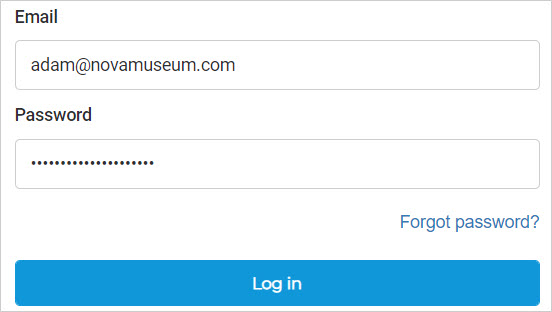
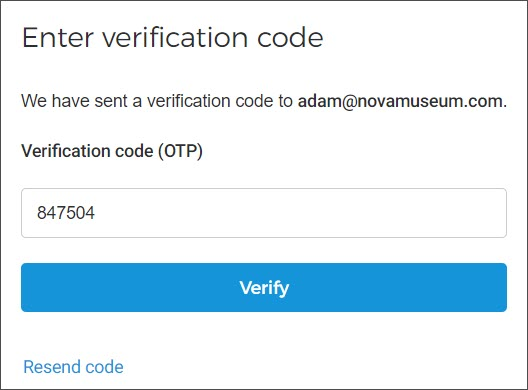
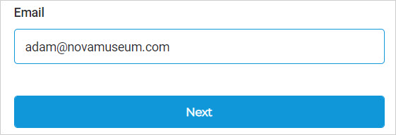
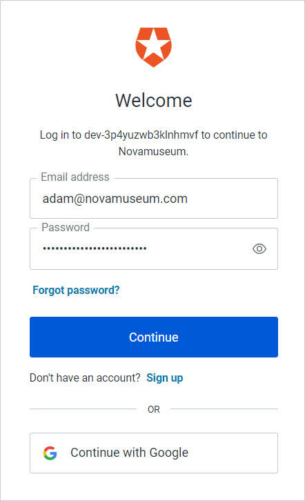

## Logging into Enviso Admin

Go to [https://cloud.enviso.io/login](https://cloud.enviso.io/login) for logging into your Enviso Admin account.

Enter your email address and your password to log into your Enviso account.

### Login types

Depending on the login type configured for your organisation, the procedure to log into Enviso will slightly differ.

This is the default way to log into Enviso. Enter the email address and password registed in Enviso.

If [two-factor authentication](UUID-91329744-a6f0-4e93-e3b7-7f913d181def.html) is enabled, then you will need to authenticate yourself additionally using a verification code.

You can log in using your OPENID username.

As a part of SSO login, you will be required to enter your OPENID user name on the Enviso login page.

Next, you will be redirected to the identity provider for authenticating the credential. This is a one-time process. Thereafter, you will be navigated back to Envsio.

For subsequent logins, you can log in using only your OPENID username.


![[Note]](media/note.png)
If you wish to use sign-on (SSO) for Enviso login, contact [Vintia support](https://vintia.atlassian.net/servicedesk/customer/portal/8) .


![[Note]](media/note.png)