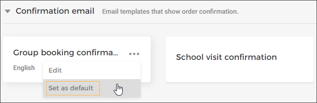

#### Set template as default

Setting an email template as default means, that the template will be used when no template is [linked with an offer](https://help.gantner.com/enviso/en/134879-135207-create-an-offer.html#134879-135217-email-templates) .

It is possible to set an email template as default, in either of the two ways:

At the time of publishing the template. Refer [Publish email template](UUID-3ac6ae3d-9dec-a704-bcdc-36a4c9a315b1.html)

From the more options menu on the email template card.

