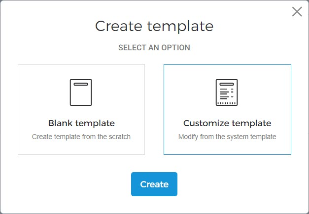
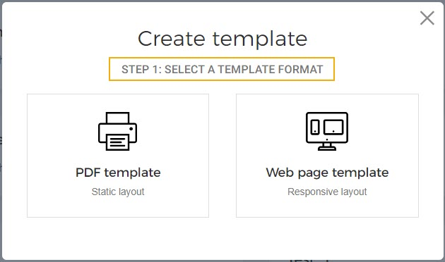
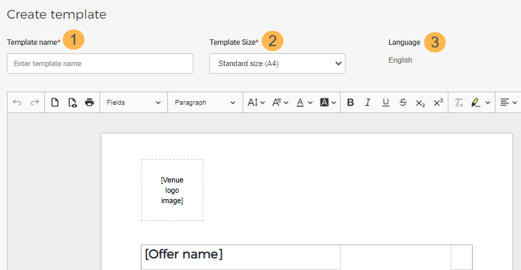

#### Create product template

On the Product templates page, click in the top-right corner.

In the resulting pop-up, you can choose to either create a new template from scratch or customise the default template provided by Vintia.


![[Note]](media/note.png)
In case the option to create [Responsive](UUID-5156baa7-4d9b-d8e9-fcd0-7e3052a3906a.html#UUID-5156baa7-4d9b-d8e9-fcd0-7e3052a3906a_section-idm4517193403729633750335349604) templates is enabled for your Venue, you will have a prior step of choosing the template format as PDF or Web page.


![[Note]](media/note.png)

Next, you will be navigated to the template editor window.

Enter the name of the template. The template name is for your reference, and it will not be shown to visitors.

Here you can select from the options Standard size (A4) or Custom size.

Note that the language selected is English. This is because a template is created in English, by default. Later on, it is possible to [add translations](UUID-5320ad87-921d-ee72-df1e-273e1e1dfba5.html) in multiple languages.

Next, you can make changes to a template using the editing tools. For a detailed description, refer [Edit product template](UUID-5abfa02d-7f4e-67a1-0392-3926cffd33f0.html)