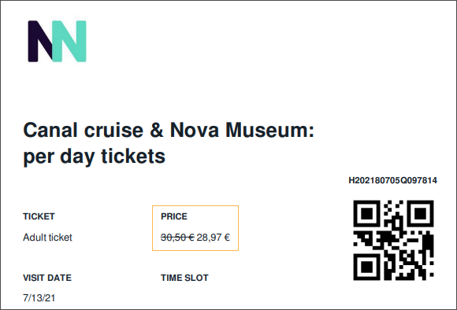

## FAQs

### Not able to create a user's account in spite of sufficient permissions.

Contact [Vintia support](https://vintia.atlassian.net/servicedesk/customer/portal/8) to check if an account has already been created with the same email ID for another tenant on Enviso.

### How can I get the list of people who want newsletters?

Go to . You might need to refresh the page to see a notification for the ready-to-download CSV. In the exported CSV, filter the column ‘IsNewsletterSubscriber?’ with the value ‘Yes’ to see the list of visitors who want newsletters.

### Can pre-visit and post-visit emails be selected per offer?

Currently, there is only 1 default email template that will be used for all the offers.

### Can the visitor see the original price as well as the discounted price on the ticket?

If a valid promo code has been applied at the time of sales, then, by default, the original price will show slashed off and the discounted price will show next to it in the ticket. For this, the field should be used in the ticket template.

