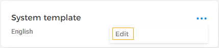
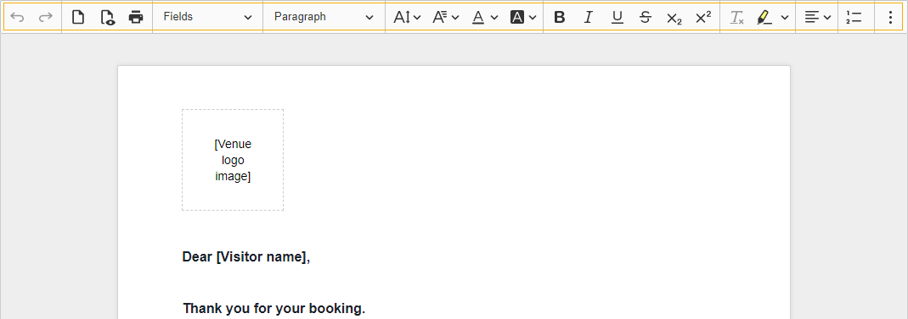
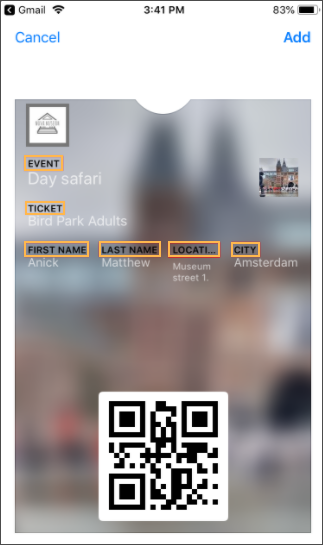
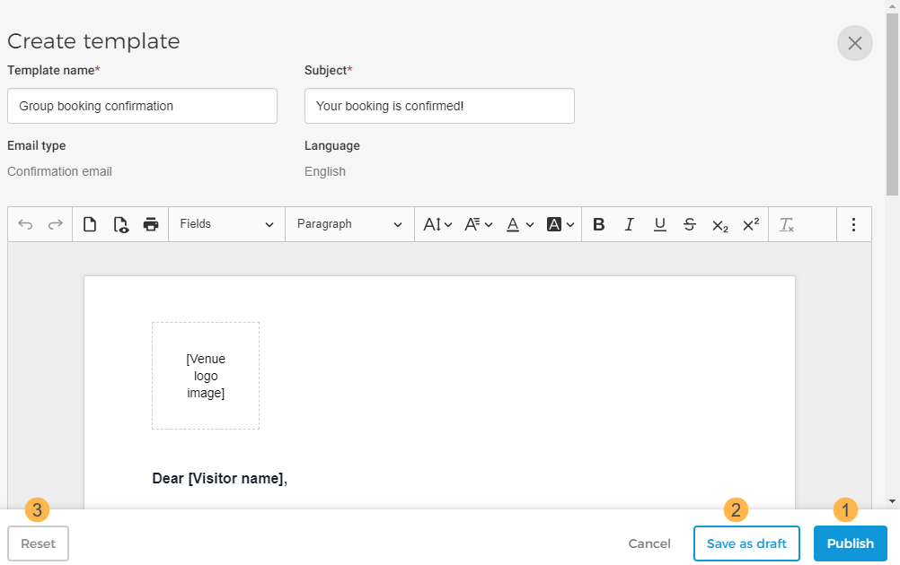

#### Edit email template

Select from the more options drop-down for the template that you wish to edit. It is possible to edit a newly created template as well as the System template. The System Template is a default template provided by Vintia.

Next, using the tool panel on the template editor you can customise the template.

You can add more fields from the drop-down.

For the 'Fields' options that have height and width parameters, if you define measurement for one parameter and define the other as auto, the other parameter will automatically take its appropriate measurement as per the screen size when the ticket is downloaded.

You can preview the email template using the button in the toolbar.

When tickets are sent to the visitors, it is possible to provide the iPhone/iPad users an option to download the tickets in their Wallet app. To do so, from the Fields drop-down select .

For Android users, if they already have an app installed similar to Wallet, they will have the option to download the ticket into that app.

Passbook supports English, Dutch, French, German, Spanish and Polish. This means that if ticket is sent in any of these languages, the labels in the ticket will be translated in the chosen language.

For languages apart from these, the labels will show in English.

In case you do not see the field option Passbook, refresh the webpage and try again.

After making changes in the email template, you can publish the template, save it as a draft or reset it to the System template.

When you publish an email template, it will be available for being [linked to an offer](/document/preview/134966#UUID-062ab2d1-63d0-ec4d-45d0-65f8721ad55a) . For a detailed description, refer [Publish email template](UUID-3ac6ae3d-9dec-a704-bcdc-36a4c9a315b1.html)

If the changes have been saved as draft, the email template will be flagged as Unsaved draft version on its detail page.

Note that on the preview screen, the last saved version of the template will be shown.

However, when you navigate to the template editing window, the draft version will show.


![[Note]](media/note.png)
It is possible to [add translations](UUID-5320ad87-921d-ee72-df1e-273e1e1dfba5.html) for offer in draft or published state.


![[Note]](media/note.png)

If you wish to revert to the System template, use the button at the bottom of the ticket template editor.


![[Note]](media/note.png)
Vintia makes periodic enhancements in the system template. To make use of the latest changes in the System template, please reset the template.


![[Note]](media/note.png)