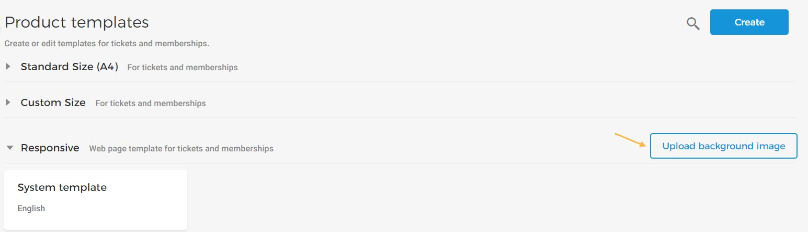
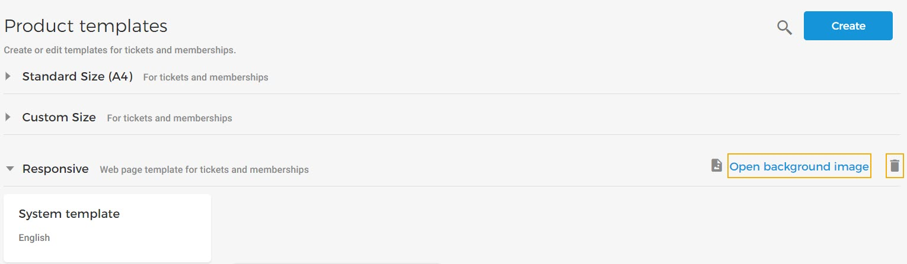

#### Set background image

For your [responsive](UUID-5156baa7-4d9b-d8e9-fcd0-7e3052a3906a.html#UUID-5156baa7-4d9b-d8e9-fcd0-7e3052a3906a_section-idm4517193403729633750335349604) product templates, you can upload a background image that will show as a banner image for the tickets and memberships delivered as a web page.

On the Product template page, in the section 'Responsive' click .

Once uploaded, you will be able to view the uploaded image, as well as delete it.


![[Note]](media/note.png)
The possibility to use a Responsive template is available to . You can request [Vintia support](https://vintia.atlassian.net/servicedesk/customer/portal/8) to enable this feature for your Venue.


![[Note]](media/note.png)